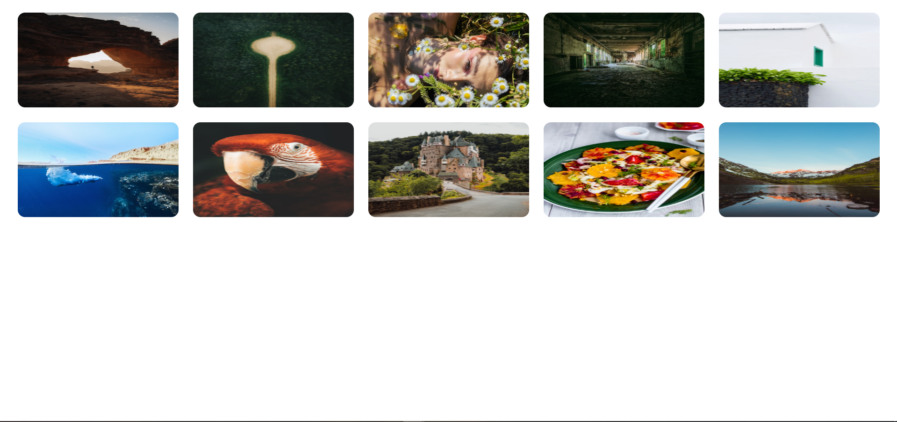

# Image gallery

**Вы также можете прочитать этот README на [русском](https://github.com/klekwedge/cv/blob/main/README.md)**

## Table of contents

- [Deployment instructions](#deployment-instructions)
- [Overview](#overview)
  - [Screenshot](#screenshot)
  - [Links](#links)
- [My process](#my-process)
  - [Built with](#built-with)
  - [What I learned](#what-i-learned)
- [Author](#author)

## Deployment instructions

**To run the project, you need to have [npm](https://nodejs.org/en/) and [git](https://git-scm.com/downloads) installed on your computer**

1. Make a clone of this repository ```git clone https://github.com/klekwedge/example.git```
2. Install all required npm packages with ```npm i```
3. Run the project with the command ```npm run dev```

## Overview

It is necessary to lay out an adaptive page with a list of photos.
​
When you click on a photo, a modal window opens with a photo, a list of comments and a form for adding comments.
​
Handle List:
* GET `https://boiling-refuge-66454.herokuapp.com/images` - get a list of photos.
* GET `https://boiling-refuge-66454.herokuapp.com/images/:imageId` - get a large image and a list of comments.
* POST `https://boiling-refuge-66454.herokuapp.com/images/:imageId/comments` - adding a comment (204 - OK, comment not saved).

We will appreciate if:
- the application will run locally after `npm i && npm run start`;
- the application is written in React;
- no external components are used, for example, a modal window;
- UX taken into account.

### Screenshot



### Links

- [Solution URL](https://github.com/klekwedge/example)
- [Live Site URL](https://klekwedge-example.vercel.app/)

## My process

### Built with

- React
- TypeScript
- Redux Toolkit
- SCSS
- Chakra UI

### What I learned

## Author

- [Website](https://klekwedge-cv.vercel.app/)
- [Linkedin](https://www.linkedin.com/in/klekwedge/)
- [Facebook](https://www.facebook.com/klekwedge)

